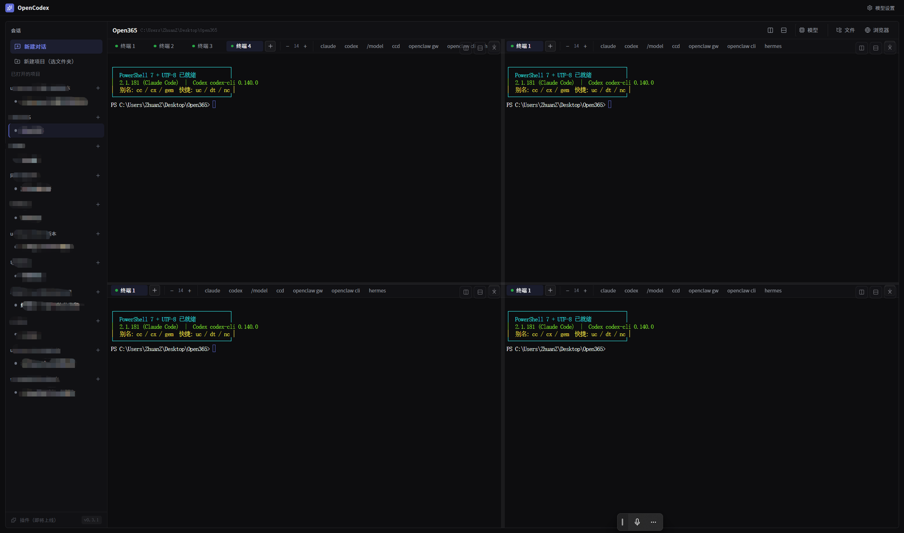

# OpenCodex

**简体中文** · [English](./README.en.md)

> 开源、绿色（免安装）的本地编程工作台 —— 以**文件夹**为基础的多终端 AI 编程与管理。

OpenCodex 是一个 Codex 同款体验的桌面工作台：选一个项目文件夹 → 主区直接是**应用内真终端**，跑 Claude Code / Codex 等 CLI → 随手左右/上下分屏多开 → 需要时从顶栏滑出文件树、浏览器。常驻保活，切会话不杀终端进程。

完全本地、开源、**自带模型**：不内置任何 API Key、不指向任何中转/服务器。你填自己的 Base URL + API Key（DeepSeek / 智谱 / Kimi / Anthropic 官方 / 本地 ollama / 任意 OpenAI·Anthropic 兼容端点都行）。



## 为什么做这个

Codex 这类工具，可以说是 AI 发展史上的第一辆「自动挡汽车」—— 一个全能的六边形战士，与其叫战士，不如说是一个**个人小军团**：

- **基于文件夹的多进程管理**：一座现代化的「文件加工工厂」。这是最基本、却最关键的能力 —— 很多大厂的产品经理到现在抄作业都还没抄会。
- **类 Manus 的办公集成**：拉个邮件、写个 Notion，办公流程串起来。
- **Computer Use（电脑操控）**：这才是王炸 —— AI 发展史上第一辆自动挡汽车，能解锁的功能和玩法多到数不过来。
- **编程**：也行，但太磨蹭，像在绣花 —— 远不如 Claude Code 那种「喀秋莎火箭炮」式的力大无边（当然都还没到核弹级）。
- **生图**：核弹级别，美工、前端全线吃紧。
- 几大优势兵种综合起来，就是战无不胜的**罗马军团**。最近 Codex 还允许接「外援雇佣兵」—— 第三方模型也能放进来，更香了。

但 Codex 本身有两个硬伤：**不开源，而且体积太重**。

### 我们看到的竞争格局与痛点

1. 现有竞争对手产品普遍**太重**。
2. 以前虽然有一些多任务、多终端管理工具，但大多是**面向人**的操作逻辑。
3. 目前还**缺乏像 Codex 这样面向 AI、支持多终端编程协同**的轻量工具。

### 于是有了 OpenCodex

- **核心能力**：基于文件夹实现高效的多任务、多终端管理，做到了很高的完成度。
- **协作模式**：在一个文件夹下打开多个终端，同时跑多个 Claude Code 等工具做**多进程编程**，体验非常顺畅。
- **轻量化方案**：针对 Codex 不开源、体积重的问题，做了这个**约 4.7MB 的绿色版**（Tauri，复用系统 WebView，不打包浏览器内核），更贴合实际开发场景。

一句话：把 Codex「面向 AI 的多终端工厂」这一最核心、最被低估的能力，做成一个开源、绿色、自带模型的轻量工具 —— 自己用得哇哇叫，索性开源出来。

### 后续规划

- 先把当前 **Demo 版**做扎实、跑起来。
- 后期持续叠加更多能力（本地大模型管家、办公集成等）。
- 做**多语言版本面向全球发布**，在 GitHub 上开源看看反响。

## 特性

- **文件夹为基础的多终端工厂**：每个项目一个文件夹，左侧按项目分组列出全部会话；主区直接是终端。
- **多终端分屏多开**：一个文件夹里左右/上下分屏开多个终端，同时跑多个 Claude Code 等 CLI 做多进程编程。分屏只挪位置不重建，**正在跑的终端永不被杀**。
- **应用内真终端（PTY）**：Rust 起伪终端（`portable_pty`），前端 xterm.js + **WebGL 渲染**（高频 TUI 刷新顺滑）。PATH 自动注入便携 Node/Python 与 `npm` 全局目录，`claude`/`codex` 等可直接跑。关闭终端**连子进程树一起清**，不留孤儿进程。
- **拖放落路径**：把文件 / 图片 / 文件夹拖进终端 → 真实路径自动填进命令行（贴图给 Claude Code 看、喂文件路径都顺手）。
- **布局记忆 + 字号可调**：分屏排布关 App 重开自动恢复；字号 `Ctrl ±` / 标签栏按钮实时调，存盘统一。
- **滑出式面板**：顶栏点一下，从右侧滑出文件树 / 浏览器，可拖宽、可收起。
- **自带模型**：「模型设置」里填 Base URL / API Key / 模型名，写进 `~/.claude/settings.json` 的 env 块，热生效。
- **绿色 exe**：约 4.7MB，体积优先的 release profile（`opt-level=z` + LTO + strip），单文件可执行，复用系统 WebView 不打包浏览器内核。

## 技术栈

两层架构，没有 sidecar：**React（WebView）⟷ Tauri 2（Rust）**。

```
src/                     前端（React 19 + Tailwind 3 + xterm.js）
├── App.tsx              顶层：整屏挂 OpenCodex + 模型设置弹层
├── components/SettingsDialog.tsx   自带模型配置 UI
└── opencodex/           工作台
    ├── OpenCodex.tsx    两区主框架（左会话列表 + 主区终端）
    ├── SessionList.tsx  左侧会话/项目列表
    ├── SplitArea.tsx    主区终端 + 顶栏开关 + 右侧滑出面板（文件/浏览器）
    ├── store.tsx        工作台状态（useReducer + Context）
    ├── panels/          TermPanel / FilesPanel / BrowserPanel
    └── term/            多终端引擎（useTermGroup / SplitContainer，平铺渲染 + 布局持久化）

src-tauri/src/           后端（Rust）
├── lib.rs               command 注册 + 入口（含 --term-test 无头模式）
├── paths.rs             子进程 PATH 注入 + 便携运行时定位（唯一真相源）
├── config.rs            自带模型配置（写 ~/.opencodex + ~/.claude/settings.json）
├── term.rs              应用内 PTY 终端
├── tasks.rs             会话/任务持久化（~/.opencodex/tasks.json）
├── agent/               结构化 claude 对话流（stream-json → 卡片）
└── fs.rs                文件面板（list_dir / read_text_file）
```

## 开发

```bash
pnpm install            # 装前端依赖
pnpm tauri dev          # 开发模式（弹窗 + HMR）
cd src-tauri && cargo check   # Rust 快速类型检查
pnpm tauri build        # 出 exe + 安装包
```

无头自检（不依赖 GUI，验证 PTY + PATH 注入）：

```bash
cargo run -- --term-test "node --version"
```

## 使用

1. 启动 OpenCodex。
2. 右上角「模型设置」→ 填你的 Base URL / API Key / 模型名（可点预设快速填充）。
3. 对话功能依赖 `claude` CLI —— 若未装，在终端面板里跑 `npm i -g @anthropic-ai/claude-code`。
4. 「新建项目」选一个文件夹 → 开聊。需要时从对话顶栏开终端 / 文件 / 浏览器。

## 数据位置

- 会话列表：`~/.opencodex/tasks.json`
- 模型配置：`~/.opencodex/config.json` + `~/.claude/settings.json`（env 块）
- 可选便携运行时：`~/.opencodex/runtime/{node,python}`（解压到此即被自动发现并加入 PATH）

## 协议

[MIT](./LICENSE)。本项目不含任何内置密钥、计费、激活或遥测代码 —— 纯本地工具。

> "Claude"/"Claude Code" 是 Anthropic 商标，"Codex" 是 OpenAI 商标。OpenCodex 是独立开源项目，与两家公司无隶属/背书关系，仅运行你自行配置的 AI CLI 与模型端点。

---

由内部工作台模块剥离全部商业 / 分发逻辑后开源化。
