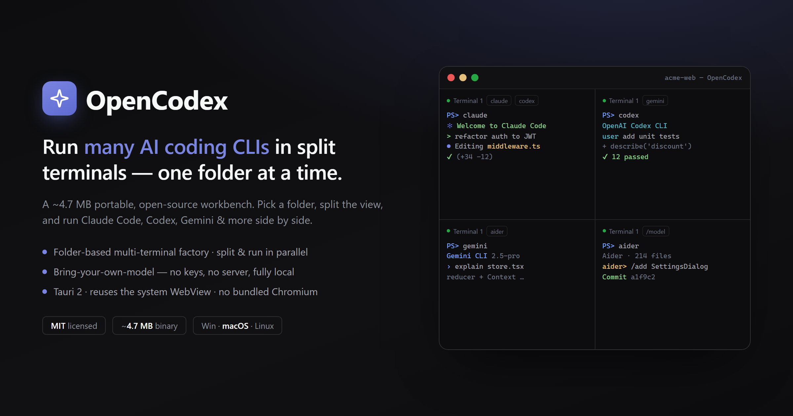
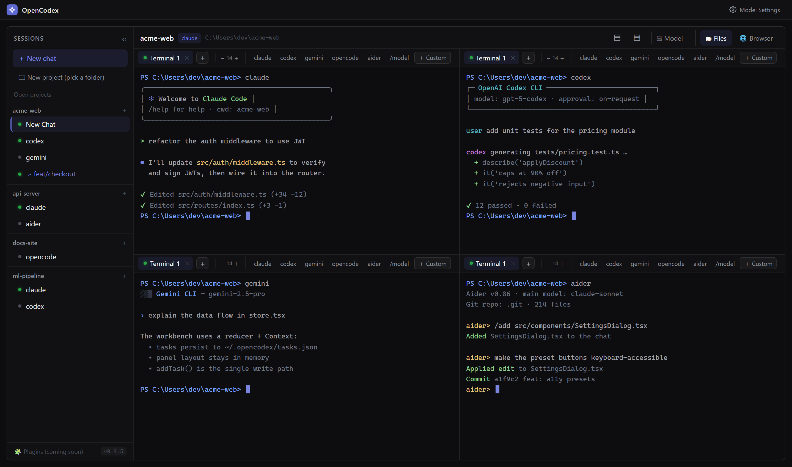

<div align="center">



# OpenCodex

**English** · [简体中文](./README.zh.md)

### A ~5.68 MB portable workbench for running multiple AI coding CLIs in split terminals — one folder at a time.

[](./LICENSE)
[](https://tauri.app)


</div>

OpenCodex is a Codex-style desktop workbench: pick a project folder → the main area **is a real in-app terminal** where you run Claude Code, Codex, Gemini CLI, Aider, opencode, and other CLIs → split it left/right or top/bottom to run several at once → slide out a file tree or browser from the top bar when you need it. Everything stays alive — switching sessions never kills your terminal processes.

**Fully local, open-source, bring-your-own-model.** It ships no API keys and points at no relay or server of its own. You fill in your own Base URL + API Key — any OpenAI- or Anthropic-compatible endpoint works (Anthropic, DeepSeek, Zhipu, Kimi, local ollama, whatever you run).



## Highlights

- **🗂️ Folder-based multi-terminal factory** — one folder per project; sessions grouped by project on the left; the main area is the terminal.
- **🪟 Split & run many** — split left/right or top/bottom inside one folder and run several AI CLIs for parallel, multi-process coding. Splitting only **repositions** panes; a running session is never destroyed.
- **⚡ Real in-app terminal (PTY)** — a Rust-owned pseudo-terminal (`portable_pty`) rendered by xterm.js with **WebGL**, smooth under high-frequency TUI repaints. PATH auto-injects portable Node/Python and the global `npm` dir, so `claude` / `codex` just work. Closing a terminal **kills the whole child-process tree** — no orphans.
- **🫳 Drag to drop paths** — drag a file / image / folder into the terminal and its real path is typed into the command line (handy for showing images to Claude Code or feeding file paths).
- **💾 Layout memory + adjustable font** — split layout restores on relaunch; font size via `Ctrl ±` or the toolbar, persisted.
- **📑 Slide-out panels** — from the top bar, slide out a file tree or browser; resizable and dismissable.
- **🔑 AI Setup Center** — see which local AI CLIs are detected and keep each one on its own existing configuration. Optionally set a compatible endpoint for OpenCodex's structured Claude Code chat only; it never touches terminal sessions, CLI global config, login state, or system environment variables.
- **🪶 Portable ZIP** — ~5.68 MB exe plus an empty `portable-data/` folder, size-first release profile (`opt-level=z` + LTO + strip), reusing the system WebView (no bundled Chromium). Separate extracted folders keep their data isolated.

## Why this exists

Most desktop AI-coding tools are heavy (Electron, ~200 MB) and built around human-facing workflows. There still isn't a lightweight, AI-first tool for **multi-terminal coding collaboration** the way Codex approaches it — open a folder, split into several terminals, and run multiple Claude Code / Codex sessions in parallel.

OpenCodex does exactly that in a ~5.68 MB exe (Tauri, reusing the system WebView). It takes the most underrated capability — the folder-based, AI-facing multi-terminal factory — and makes it open-source, portable, and bring-your-own-model.

It's an early Demo, and it's what I use daily.

## Quick start

```bash
pnpm install            # install frontend deps
pnpm tauri dev          # dev mode (window + HMR)
pnpm tauri build        # produce exe + installer
```

Headless self-test (no GUI; verifies PTY + PATH injection):

```bash
cargo run -- --term-test "node --version"
```

## Usage

1. Launch OpenCodex.
2. Top-right **AI Setup Center** shows detected CLIs and leaves each CLI on its own configuration. Optionally enable a temporary compatible endpoint for OpenCodex's structured Claude Code chat (presets available); terminal sessions stay untouched.
3. Run any CLI in the terminal — `claude`, `codex`, `gemini`, `aider`, `opencode`… If one isn't installed, install it right there in a terminal pane (e.g. `npm i -g @anthropic-ai/claude-code`).
4. **New project** → pick a folder → start working. Split for more terminals; slide out files / browser when needed.

## Stack

Two layers, no sidecar: **React (WebView) ⟷ Tauri 2 (Rust)**.

## Data locations

- Portable release: `portable-data/tasks.json`, `portable-data/kv.json`, and optional `portable-data/config.json` beside the exe. Do not share a portable-data folder after you have used it.
- Fallback without `portable-data/`: `~/.opencodex/tasks.json` and optional `~/.opencodex/config.json`.
- Optional portable runtime: `portable-data/runtime/{node,python}` (unzip here to be auto-discovered and added to PATH)

## License

[MIT](./LICENSE). No bundled keys, billing, activation, or telemetry — a pure local tool.

> "Claude" / "Claude Code" are trademarks of Anthropic; "Codex" is a trademark of OpenAI. Other CLIs (Gemini CLI, Aider, opencode) belong to their respective owners. OpenCodex is an independent open-source project, not affiliated with or endorsed by any of them, and only runs the AI CLIs and model endpoints you configure.
